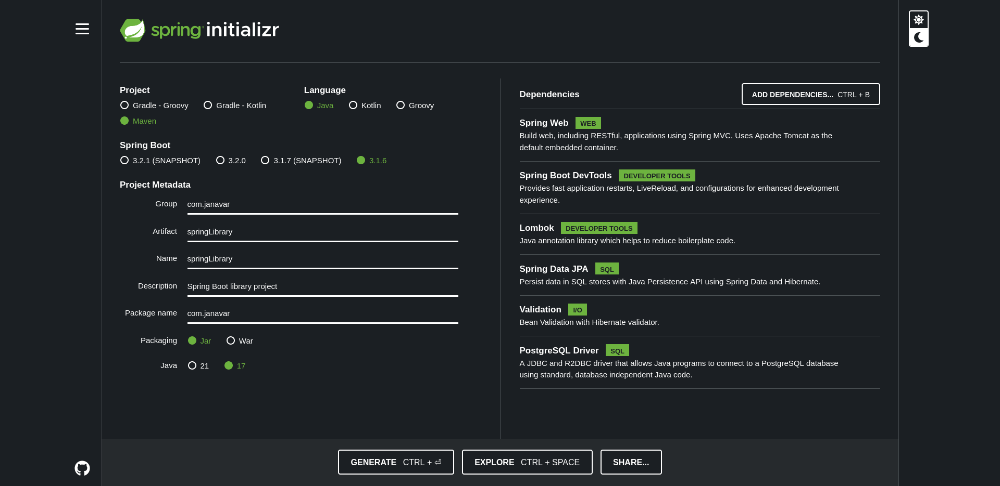

# Kütüphane Projesi
Bu proje, Spring Boot kullanılarak geliştirilen basit bir kütüphane yönetim projesidir.  

## Gereklilikler

## Proje Tanımı

Proje, iki POJO Classı içerir ve veritabanı bağlantısı olmadan basit kütüphane Kitaplarıyla ilgili bilgileri saklamak ve CRUD işlemlerini gerçekleştirmek için tasarlanmıştır.

## Controller Katmanı

BookController Classi

public ResponseEntity<List<Book>> listAllBooks()
public ResponseEntity<Map<String, String>> createBook(@Valid @RequestBody Book Book)
public ResponseEntity<Book> getBookById(@PathVariable("id") Long id)
public ResponseEntity<String> deleteBook(@PathVariable("id") Long id)
public ResponseEntity<String> updateBook(@PathVariable("id") Long id, @Valid @RequestBody BookDTO BookDTO)

## Domain Katmanı 

#### Book Classı

Bu Class, kütüphanedeki Bookların temel özelliklerini içerir.

- **Alanlar (Fields):**
  - `bookID` : **Long** Kitabın adı
  - `bookName`: **String** Kitabın adı
  - `basimYili` : **Int** Kitabın basım yılı
  - `yazari` : **String** Kitabın yazarı
  -`sayfaSayisi`: **Int**Kitabın sayfa sayısı
  - `tur` : **String** Kitabın türü

  

#### Member Class

Bu Class, kütüphaneye uye olan kisilerin temel ozelliklerinie içerir.

  

- **Alanlar (Fields):**
- `memberId` : **Long** Uye Id si
- `memberName` : **String** Uye adı
- `memberSurname` : **String** Uye Soyadi
- `memberMobilePhone`: **Int** Uye telefon

  

@JoinTable(name="tbl_member_book",
joinColumns = @JoinColumn(name="member_id"),
inverseJoinColumns = @JoinColumn(name="book_id"))
@OneToMany(fetch=FetchType.EAGER)

private List<Book> books= new ArrayList<>();

  

#### Methodlar

Bu Class, temel getter ve setter methodlarıyla birlikte CRUD işlemlerini gerçekleştirecek methodları içerir.
- `getBookAdi()`: Kitabın adını getirir.
- `setBookAdi(String BookAdi)`: Kitabın adını ayarlar.
- `getBasimYili()`: Kitabın basım yılını getirir.
- `setBasimYili(int basimYili)`: Kitabın basım yılını ayarlar.
- `getYazari()`: Kitabın yazarını getirir.
- `setYazari(String yazari)`: Kitabın yazarını ayarlar.
- `getSayfaSayisi()`: Kitabın sayfa sayısını getirir.
- `setSayfaSayisi(int sayfaSayisi)`: Kitabın sayfa sayısını ayarlar.
- `getTur()`: Kitabın türünü getirir.
- `setTur(String tur)`: Kitabın türünü ayarlar.
- `createBook()`: Yeni bir Book oluşturur.
- `readBook()`: Var olan bir kitabın bilgilerini getirir.
- `updateBook()`: Var olan bir kitabın bilgilerini günceller.
- `deleteBook()`: Var olan bir kitabı siler.

## DTO Katmanı
#### BookDTO Classı
Bu Class, kütüphanedeki Bookların temel özelliklerini içerir.

- **Alanlar (Fields):**
	- `BookAdi` : **String** Kitabın adı
	- `basimYili` : **Int** Kitabın basım yılı
	- `yazari` : **String** Kitabın yazarı
	- `tur` : **String** Kitabın türü
	- `sayfaSayisi`: **Int** Kitabın sayfa sayısı

## Exception Katmanı
* ResourceNotFoundException Class

## Repository Katmanı
BookRepository Class

Service Classinin veritabanindan istedigi Crud islemlerini yapar.

1. **Kitap Ekleme:**
   - `createBook()` methodunu kullanarak yeni bir Book ekleyebilirsiniz.
   2. **Kitap Okuma:**
   - `readBook()` methoduyla var olan bir kitabın bilgilerini alabilirsiniz.
3. **Kitap Guncelleme:**
   - `updateBook()` methoduyla var olan bir kitabın bilgilerini güncelleyebilirsiniz.
4. **Kitap Silme:**
   - `deleteBook()` methoduyla var olan bir kitabı silebilirsiniz.
5. **Tum Kitapları Listeleme:**
   - `listAllBook()` methodunu kullanarak yeni bir Book ekleyebilirsiniz.

## API Endpoint'leri

- Kitap Listesi:
	- Path: /books
	- Method: GET
	- Açıklama: Tüm Kitaplari listeler.
- Kitap Detayı:
	- Path: /book/{bookId}
	- Method: GET
	- Açıklama: Belirli bir kitabı getirir.
- Kitap Ekleme:
	- Path: /books
	- Method: POST
	- Açıklama: Yeni bir kitap ekler.
- Kitap Listesi Ekleme:
	- Path: /books/books
	- Method: POST
	- Açıklama: Yeni kitaplar ekler.
- Kitap Güncelleme:
	- Path: /books/{bookId}
	- Method: PUT
	- Açıklama: Belirli bir kitabı günceller.
- Kitap Silme:
	- Path: /book/{bookId}
	- Method: DELETE
	- Açıklama: Belirli bir kitabı siler.
## Service Katmanı 
### BookService Class

Proje temel olarak Book Classinin işlemlerini gerçekleştirmek için tasarlanmıştır.

Aşağıda temel kullanım adımları bulunmakta
1. **Kitap Ekleme:**
	- `createBook()` methodunu kullanarak yeni bir Book ekleyebilirsiniz.
2. **Kitap Okuma:**
	- `readBook()` methoduyla var olan bir kitabın bilgilerini alabilirsiniz.
3. **Kitap Güncelleme:**
	- `updateBook()` methoduyla var olan bir kitabın bilgilerini güncelleyebilirsiniz.
4. **Kitap Silme:**
	- `deleteBook()` methoduyla var olan bir kitabı silebilirsiniz.
5. **Tum Kitaplari Listeleme:**
	- `listAllBooks()` methodunu kullanarak yeni bir Book ekleyebilirsiniz.

  

### MemberService Class

Proje temel olarak Member Classinin işlemlerini gerçekleştirmek için tasarlanmıştır.

Aşağıda temel kullanım adımları bulunmakta

1. **Member Ekleme:**
	- `createMember()` methodunu kullanarak yeni bir Book ekleyebilirsiniz.
2. **Uye Book Odunc Alma**
	- `lendBook()` methoduyla var olan bir kitabi uyeye atayabilirsiniz.
3. **Uye Book Geri Getirme**
	- `lendBookBack()` methoduyla var olan bir kitabi uyeden kutuphaneye atayabilirsiniz.
4. **Member Güncelleme:**
	- `updateMember()` methoduyla var olan bir kitabın bilgilerini güncelleyebilirsiniz.
5. **Uye Silme:**
	- `deleteMember()` methoduyla var olan bir kitabı silebilirsiniz.
6. **Tum Uyeleri Listeleme:**
	- `listAllMember()` methodunu kullanarak yeni bir Book ekleyebilirsiniz.

Main Classı (Main Class):

	Kullanıcı arayüzü oluşturarak kullanıcıdan girdileri alabilir ve bu girdileri Kütüphane Classı'nın metodlarına yönlendirebilir.

	Kullanıcıya menüler sunabilir ve seçilen işleme göre ilgili metodu çağırabilir